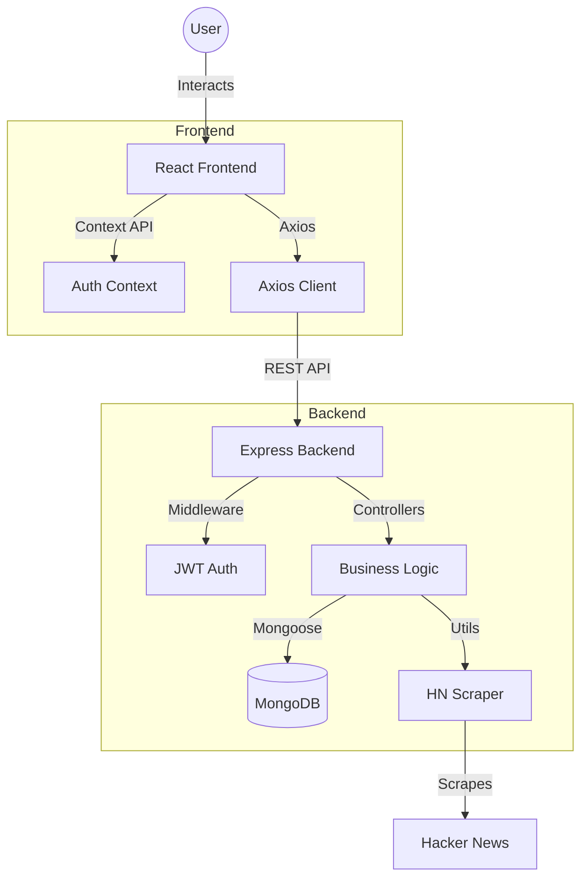
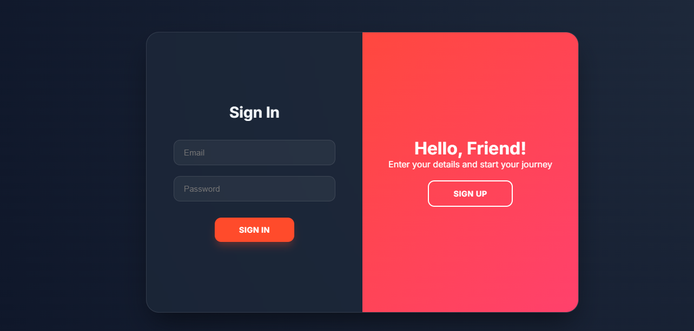
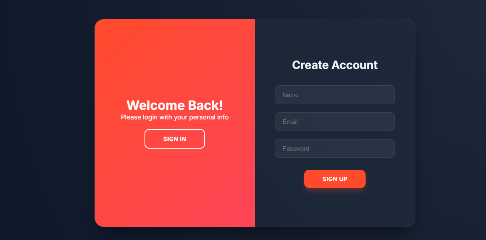
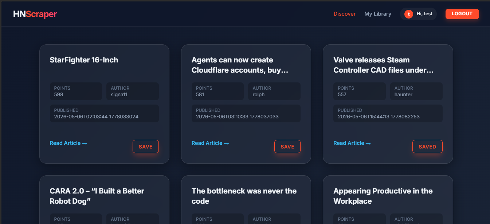

# HN Scraper - Full Stack MERN Application

A professional, high‑performance web scraper and social platform for Hacker News stories. Built with the MERN stack, featuring automated scraping, JWT authentication, and a modern glass‑morphism UI.

---

## 🏗 Architecture Diagram



---

## 📂 Project Structure

```text
Scraper-Mern/
├── backend/
│   ├── src/
│   │   ├── config/            # DB connection
│   │   ├── controllers/       # Request handlers
│   │   ├── middleware/        # Auth, error & not‑found handling
│   │   ├── models/            # Mongoose schemas (User, Story)
│   │   ├── routes/            # /api/auth, /api/stories
│   │   ├── services/          # ScraperService.js
│   │   ├── utils/             # asyncHandler, token generator
│   │   ├── app.js              # Express app + security middleware
│   │   └── server.js           # Entry point (connect DB, run scraper, listen)
│   ├── .env                    # **never committed** – see below
│   └── .gitignore              # ignores node_modules & *.env
├── frontend/
│   ├── src/
│   │   ├── api/               # Axios instance (base URL from .env)
│   │   ├── components/        # Navbar, StoryCard, etc.
│   │   ├── context/           # AuthContext – auth state & token handling
│   │   ├── pages/             # Home, Bookmarks, AuthPage
│   │   ├── styles/            # Global & component CSS (glassmorphism)
│   │   ├── App.jsx            # Router configuration
│   │   └── main.jsx           # React entry point
│   ├── .env                    # **ignored** – VITE_API_URL
│   └── .gitignore              # ignores node_modules & *.env
├── .gitignore                  # root – catches any .env files throughout repo
└── README.md                   # **this file**
```

---

## 🛠 Tech Stack

| Layer      | Technology |
|------------|------------|
| **Frontend** | Vite, React 19, React‑Router 7, Axios, vanilla CSS (glass‑morphism) |
| **Backend**  | Node .js, Express, Mongoose, JWT (jsonwebtoken), Bcrypt.js |
| **Scraper**  | Axios, Cheerio |
| **Database** | MongoDB (local or Atlas) |
| **Security** | Helmet, CORS whitelist, express‑rate‑limit |
| **Dev Tools**| Nodemon, ESLint, Prettier |

---

## 📸 Screenshots (placeholders)

| Authentication (Login) | Authentication (Sign‑Up) |
| :---: | :---: |
|  |  |

| Home Feed (glass‑morphism) |
| :---: |
|  |

---

## 🚀 Live Demo & Walkthrough

- **Live URL:** https://scraper-mern.vercel.app/
- **Demo Video:** https://www.loom.com/share/e26302a913fc4f56b9c90ad375fe26c1

---

## ⚙️ Setup (Local Development)

### Prerequisites
- Node.js v18+
- MongoDB (local instance or Atlas)

### 1. Clone the repository
```bash
git clone https://github.com/Ayushjha1622/Scraper-Mern.git
cd Scraper-Mern
```

### 2. Backend
```bash
cd backend
cp .env.example .env   # create a fresh .env file
# Edit .env if you need custom values
npm install
npm run dev            # starts server on PORT (default 5000)
```
The server will automatically run the scraper once on start and populate the `stories` collection.

### 3. Frontend
```bash
cd ../frontend
cp .env.example .env   # VITE_API_URL defaults to http://localhost:5000/api
npm install
npm run dev            # Vite dev server on http://localhost:5173
```

### 4. Create a test user (optional)
```bash
node backend/scripts/createTestUser.js   # email: test@test.com, password: test123
```
*(The helper script has been removed from the final repo; you can recreate it if needed.)*

### 5. Open the app
Visit `http://localhost:5173`, log in with the test credentials, and explore the story feed.

---

## 🔐 Environment Variables

### Backend (`backend/.env`)
```dotenv
PORT=5000
MONGO_URI=mongodb://localhost:27017/scraper
JWT_SECRET=supersecretkey123
NODE_ENV=development
```

### Frontend (`frontend/.env`)
```dotenv
VITE_API_URL=http://localhost:5000/api
```


## 📜 Scripts

| Script (backend) | Description |
|------------------|-------------|
| `npm run dev`    | Starts Nodemon with live‑reload |
| `npm start`      | Starts Node without watch (prod) |
| `npm run lint`   | Runs ESLint |
| `npm run test`   | Placeholder for future Jest tests |

| Script (frontend) | Description |
|-------------------|-------------|
| `npm run dev`     | Starts Vite dev server |
| `npm run build`   | Produces optimized `dist/` |
| `npm run preview` | Serves the production build locally |

---

## 🔐 Security Measures (already in code)
- **Helmet** – sets secure HTTP headers.
- **CORS** – restricted to the origin defined in `CORS_ORIGIN`.
- **Rate limiting** – mitigates brute‑force/DoS attacks.
- **JWT** – signed with `JWT_SECRET`, stored in `localStorage` (refresh logic can be added).
- **Password hashing** – Bcrypt with a strong salt.
- **Environment isolation** – all secrets live in `.env` files, never in source.

---

## 📡 API Endpoints

| Method | Path | Description | Auth Required |
|--------|------|-------------|---------------|
| `POST` | `/api/auth/register` | Register a new user | No |
| `POST` | `/api/auth/login`    | Login and receive JWT | No |
| `GET`  | `/api/stories`       | Paginated list of stories (`?page=&limit=`) | No |
| `GET`  | `/api/stories/:id`   | Single story details | No |
| `POST` | `/api/stories/:id/bookmark` | Toggle bookmark for authenticated user | Yes |
| `POST` | `/api/scrape`        | Manually trigger a fresh scrape (optional) | No |

All protected routes expect an `Authorization: Bearer <token>` header.

---

## 🎨 Front‑end Routing
- `/` – Home page (list of stories, pagination).
- `/bookmarks` – Bookmarked stories for the logged‑in user.
- `/login` & `/register` – Auth pages.
- Any unknown route → redirects to Home.

---

## 🧪 Testing & Linting (future work)
- Add Jest + React Testing Library for component tests.
- Add Supertest for API integration tests.
- Configure ESLint + Prettier for consistent code style.

---

## 🚀 Deployment Guide
1. **Backend** – Deploy to Render, Railway, Fly.io, or any Node host. Set the same env variables in the platform UI.
2. **Frontend** – Build with `npm run build` and deploy the `frontend/dist` folder to Vercel, Netlify, or any static host.
3. **Reverse Proxy (optional)** – Use Nginx or Cloudflare to serve both front‑end and API under a single domain, then tighten `CORS_ORIGIN` to that production URL.

---

## 📄 License
MIT © 2026 Ayush Jha – feel free to fork, modify, and use this project as a learning reference.

---

## 🙏 Acknowledgements
- **Hacker News** – public HTML source used for scraping.
- **MERN community** – countless tutorials and snippets that shaped this project.

---

*Happy hacking!*
